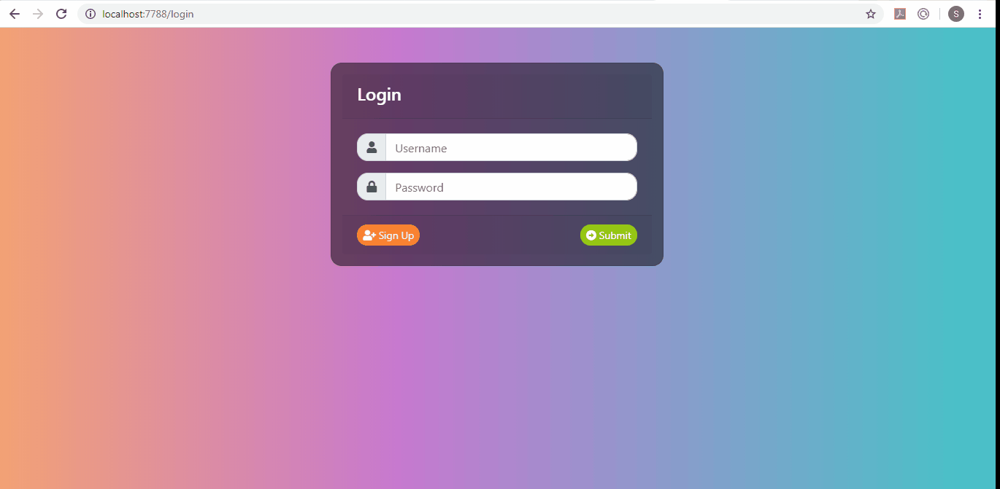

# LetsChat

## Description:
Chat Web application which allows users to register themselves and then login. Once logged in user can send messages to other already registered users. 

## Application is based on:
* *Spring Webflux* as a framework.
* *Spring Security Reactive* for authentication
* *Server Sent Events* for asynchronous Server to Client Messaging
* *Reactive MongoDB* for persisting chats.

## Demo:

## Usage:
* Download the source and build it using ``mvn clean package``
* Run the application using ``java -jar LetsChat-1.0.jar``
* Open the browser and go to ``http:\\localhost:8080``
* Signup on the signup page
* Login inside the app and start sending messages to whoever you like

## License:

